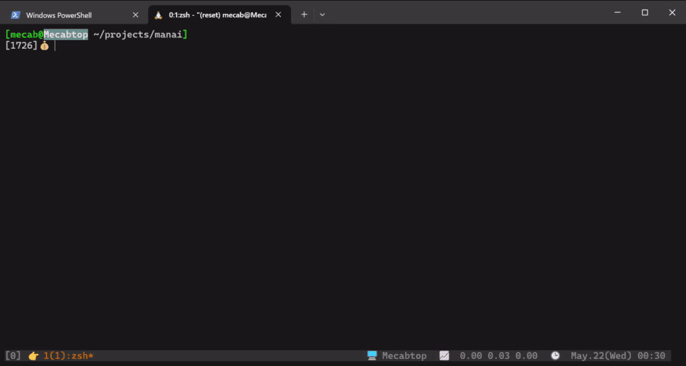

manai
=====
<div align="center">
    
</div>

manai is an AI powered interactive command line completion for Zsh. Hotkey to trigger and ask anything about your work-in-progress command line.



Prerequisites
-------------
- [Zsh](https://www.zsh.org/)
- [fzf](https://github.com/junegunn/fzf)
- [OpenAI API Key](https://platform.openai.com)

Installation
------------

1. Clone this package to somewhere you are comfortable with (e.g. `$HOME/.dotfiles/manai`)

    ```bash
    $ git clone git@github.com:mecab/manai.git $HOME/.dotfiles/manai
    ```

2. Download manai binary

    ```bash
    $ $HOME/.dotfiles/manai/download-manai.zsh
    ```

3. Source `manai.zsh` in your zshrc, set your `OPENAI_API_KEY` then bind `manai` function to any keybind

    ```bash
    $ nano ~/.zshrc
    ```

    and add the following

    ```
    export OPENAI_API_KEY="your-openai-api-key"
    source $HOME/.dotfiles/manai/manai.zsh

    # bind to `Alt-h`. Update this to your preference!
    bindkey '\eh' manai
    ```

    Note: You can also specify `MANAI_OPENAI_API_KEY` instead of `OPENAI_AI_KEY` for `manai` exclusive use.

4. then reload your zshrc

    ```bash
    $ exec $SHELL -l
    ```
